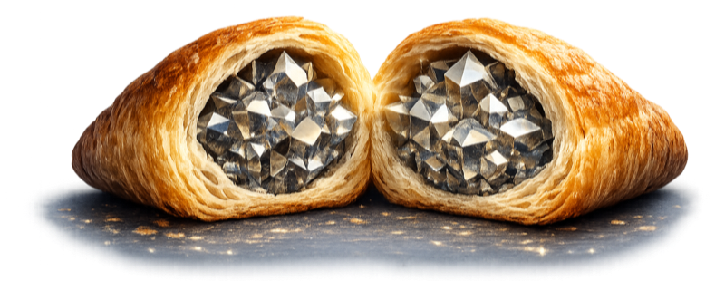

# Reverse Pastry

> Hard core, soft exterior. An architectural pattern for AI-native software.

Vibe coding builds the same rigid apps faster. Reverse Pastry builds something different: a strict data core with your AI as the interface.

[Get Started](#reverse-pastry)
[GitHub](https://github.com/reverse-pastry/reverse-pastry)
